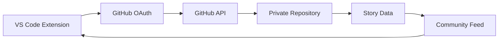

# VS Code Stories Extension


[](https://github.com/mhdstk/vscode-stories/actions)
[](https://codecov.io/gh/mhdstk/vscode-stories)
[](https://marketplace.visualstudio.com/items?itemName=mhdstk.vscode-stories)
[](https://open-vsx.org/extension/mhdstk/vscode-stories)

An Instagram-like stories feature integrated into VS Code, allowing developers to share code snippets, insights, and updates with the developer community through ephemeral 24-hour stories.

## ✨ Features

### 📱 Instagram-Like Stories
- **24-Hour Expiration**: Stories automatically disappear after 24 hours
- **Story Rings**: Visual indicators around profile pictures showing new stories
- **Sequential Viewing**: Navigate through stories with keyboard shortcuts or clicks
- **Real-time Updates**: Get notified when people you follow post new stories

### 💻 Developer-Focused Content
- **Code Snippets**: Share syntax-highlighted code with filename and language detection
- **Text Stories**: Share insights, tips, and thoughts about development
- **Mixed Content**: Combine text, code, and images in a single story
- **Project Context**: Automatically include workspace and git information

### 🤝 Social Features
- **GitHub Integration**: Authenticate with GitHub and leverage your existing network
- **Following System**: Follow developers and see their stories in your feed
- **Discovery**: Find interesting developers through organizations and topics
- **Groups & Tags**: Join developer communities and tag your stories
- **Reactions**: React to stories with developer-friendly emojis (🔥, 💡, 🐛, etc.)

### 🎨 VS Code Integration
- **Native UI**: Seamless integration with VS Code's interface and theming
- **Sidebar Panel**: Dedicated Stories sidebar with feed, following, and groups
- **Status Bar**: Quick access and story count indicator
- **Context Menus**: Right-click on code to share as a story
- **Command Palette**: Full command support for keyboard-driven workflows
- **WebView Interface**: Rich, interactive story viewing experience

### 🔒 Privacy & Security
- **Visibility Controls**: Public, followers-only, group, or private stories
- **GitHub Permissions**: Leverages GitHub's robust permission system
- **Content Sanitization**: Automatic filtering of potentially harmful content
- **Secure Storage**: All data stored securely in your private GitHub repository

## 🚀 Getting Started

### Installation

1. **From VS Code Marketplace**:
   - Open VS Code
   - Go to Extensions (`Ctrl+Shift+X`)
   - Search for "VS Code Stories"
   - Click Install

2. **From OpenVSX Registry** (for VS Code alternatives):
   - Open your VS Code compatible editor
   - Go to Extensions
   - Search for "VS Code Stories" by mhdstk
   - Click Install

3. **From Command Line**:
   ```bash
   # VS Code Marketplace
   code --install-extension mhdstk.vscode-stories
   
   # OpenVSX Registry  
   code --install-extension mhdstk.vscode-stories --from-openvsx
   ```

### First Steps

1. **Authenticate with GitHub**:
   - Open Command Palette (`Ctrl+Shift+P`)
   - Run `Stories: Sign In with GitHub`
   - Follow the authentication flow

2. **Create Your First Story**:
   - Select some code in your editor
   - Right-click and choose "Share as Story"
   - Or use `Ctrl+Shift+P` → `Stories: Create Story`

3. **Explore the Community**:
   - Click the Stories icon in the Activity Bar
   - Browse the feed, discover users, and join groups
   - Follow interesting developers to see their stories

## 📖 Usage Guide

### Creating Stories

#### Code Stories
```typescript
// Select this code and right-click "Share as Story"
const fibonacci = (n: number): number => {
  if (n <= 1) return n;
  return fibonacci(n - 1) + fibonacci(n - 2);
};
```

#### Text Stories
Share insights, tips, or thoughts about development:
- Use `Stories: Create Story` from Command Palette
- Choose "Text Story" and write your message
- Add relevant tags like `#javascript`, `#tips`, `#productivity`

#### Story Visibility
- **Public**: Visible to everyone in the community
- **Followers**: Only visible to people who follow you on GitHub
- **Group**: Share with specific developer groups
- **Private**: Only visible to you (great for notes and drafts)

### Managing Your Feed

- **View Feed**: Click the Stories sidebar or use `Stories: View Story Feed`
- **Refresh**: Click the refresh button or use `Stories: Refresh Feed`
- **Filter by Groups**: Click on specific groups to see related stories
- **Search Users**: Use `Stories: Search Users` to find specific developers

### Social Interactions

- **Follow Users**: Click on profiles and follow interesting developers
- **React to Stories**: Use emoji reactions (👍, 🔥, 💡, 🐛, etc.)
- **Join Groups**: Browse and join developer communities
- **Discovery**: Use `Stories: Discover Users` to find new people to follow

## ⚙️ Configuration

### Settings

The extension can be configured through VS Code settings:

```json
{
  "stories.autoRefresh": true,
  "stories.refreshInterval": 300000,
  "stories.defaultVisibility": "public",
  "stories.showNotifications": true,
  "stories.maxStoriesInFeed": 50
}
```

### Available Commands

| Command | Description | Keybinding |
|---------|-------------|------------|
| `Stories: Sign In with GitHub` | Authenticate with your GitHub account | - |
| `Stories: View Story Feed` | Open the main story feed | - |
| `Stories: Create Story` | Create a new story (wizard) | - |
| `Stories: Share as Story` | Share selected code as a story | - |
| `Stories: Discover Users` | Find new developers to follow | - |
| `Stories: View Profile` | View your profile and story stats | - |
| `Stories: Refresh Feed` | Manually refresh the story feed | - |

## 🏗️ Architecture

### Technical Overview

- **Frontend**: React-based WebView UI with VS Code theming
- **Backend**: GitHub API for authentication and data storage  
- **Storage**: Private GitHub repositories for user story data
- **Security**: OAuth authentication with minimal required scopes
- **Expiration**: GitHub Actions workflows for automated cleanup

### Data Flow



### Privacy & Data Handling

- **Local Storage**: Minimal caching for performance
- **GitHub Storage**: Your stories are stored in your private GitHub repository
- **No Third-Party Services**: Direct integration with GitHub, no intermediate services
- **User Control**: You own and control all your data

## 🧪 Development

### Prerequisites

- Node.js 18+ and npm
- VS Code Extension Development Environment
- GitHub Developer Account

### Setup

```bash
# Clone the repository
git clone https://github.com/mhdstk/vscode-stories.git
cd vscode-stories

# Install dependencies
npm install

# Install webview dependencies
cd webview-ui
npm install
cd ..

# Build the extension
npm run compile

# Run tests
npm test
```

### Project Structure

```
vscode-stories/
├── src/                     # Extension source code
│   ├── core/               # Core business logic
│   ├── services/           # GitHub API and external services
│   ├── ui/                 # VS Code UI integration
│   └── types/              # TypeScript type definitions
├── webview-ui/             # React-based WebView interface
├── media/                  # Extension assets and compiled webview
├── openvsx-integration/    # Web viewer for OpenVSX marketplace
└── test/                   # Test suites
```

### Contributing

1. Fork the repository
2. Create a feature branch (`git checkout -b feature/amazing-feature`)
3. Make your changes and add tests
4. Ensure all tests pass (`npm test`)
5. Commit your changes (`git commit -m 'Add amazing feature'`)
6. Push to the branch (`git push origin feature/amazing-feature`)
7. Open a Pull Request

## 📝 License

This project is licensed under the MIT License - see the [LICENSE](LICENSE) file for details.

## 🤝 Support

### Getting Help

- **Documentation**: Check this README and inline help
- **Issues**: [Report bugs or request features](https://github.com/mhdstk/vscode-stories/issues)
- **Discussions**: [Community discussions and Q&A](https://github.com/mhdstk/vscode-stories/discussions)

### Known Issues

- Story feed may take a moment to load on first authentication
- Large code snippets might be truncated (50KB limit)
- GitHub API rate limits may affect heavy usage

### Roadmap

- [ ] **Real-time Notifications**: Push notifications for new stories
- [ ] **Advanced Analytics**: Detailed story performance metrics  
- [ ] **Story Collections**: Save and organize favorite stories
- [ ] **Collaborative Features**: Team story channels and shared collections
- [ ] **Mobile Companion**: Mobile app for viewing stories on the go
- [ ] **AI Integration**: Smart story suggestions and code explanations

## 🙏 Acknowledgments

- **VS Code Team**: For the excellent extension APIs and documentation
- **GitHub**: For providing robust APIs for authentication and storage
- **Community**: All the developers who will make this extension awesome!

---

**Happy Coding! 🚀**

*Built with ❤️ for the developer community*